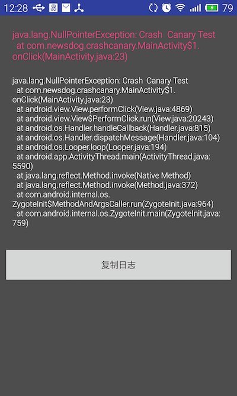

# CrashCanary 


CrashCanary 是一个记录Android 应用程序 Crash的库，当程序发生Crash时CrashCanary会将Crash 日志存储到本地，并且在下次进入应用时通过通知栏提示开发人员，开发人员点击通知栏即可进入到Log详情页面。开发人员也可以手动查看Crash日志列表以及每个Log的详细信息. [下载示例apk](demo.apk?raw=true "download")

示例代码如下: 

```java
public class MainActivity extends AppCompatActivity {

    @Override
    protected void onCreate(Bundle savedInstanceState) {
        super.onCreate(savedInstanceState);
        setContentView(R.layout.activity_main);

        final CrashCanary crashCanary = new CrashCanary.Builder(this)
                // 设置自己的异常处理 Handler
                .setExceptionHandler(new Thread.UncaughtExceptionHandler() {  
                    @Override
                    public void uncaughtException(Thread thread, Throwable ex) {

                    }
                })
                .setKillProcessWhenCrash(true)  // 发生crash之后关闭应用,再次进入应用时会有crash通知
                .build();

        Button btn = (Button) findViewById(R.id.submit_btn);
        btn.setOnClickListener(new View.OnClickListener() {
            @Override
            public void onClick(View v) {
            		// 模拟一个Crash
                throw new NullPointerException("Crash  Canary Test");
            }
        });

        findViewById(R.id.show_btn).setOnClickListener(new View.OnClickListener() {
            @Override
            public void onClick(View v) {
                crashCanary.showLogListDialog(MainActivity.this);
            }
        });
    }
}
```

## 效果



